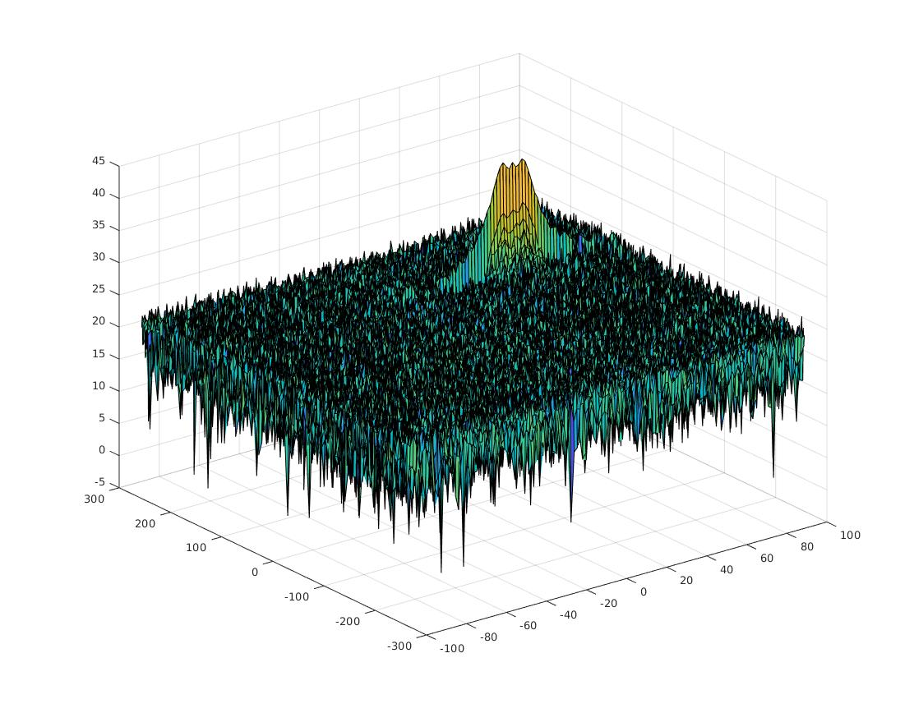
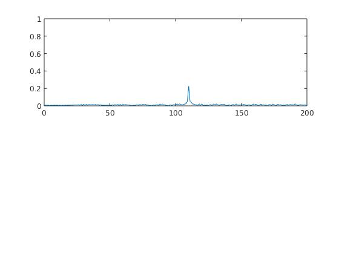
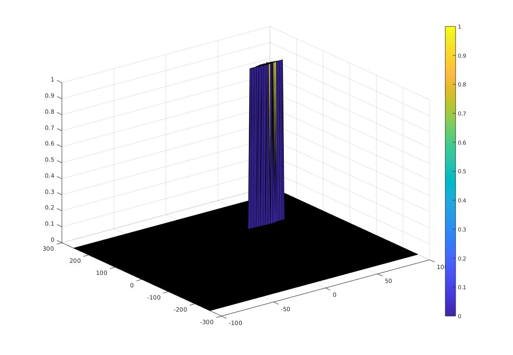

# Radar_Target_Generation_and_Detection

### Introduction

A simulation of radar detection in matlab. Through the configuration of FMCW and assign the initial position and velocity, perform 2d FFT to the beat signal and CA_CFAR to the RDM to display the distance and velocity of the target. This is a project design by Udacity.

_The RDM(Range Doppler Map) after 2D FFT_

_The first FFT processing the beat signal, remember keep only half of the signal because of the Nyquist Frequency_

### Usage
Get the code and [download](https://ww2.mathworks.cn/campaigns/products/trials.html?procode=ML) the matlab, run the `Radar_Target_Generation_and_Detection.m` file directly.

### Selection of Training, Guard cells and offset
1. The decision of training cells number is based on if traffic scenario is dense, on such a case fewer training cells better. On this project I select 20*10 for discrete target signal.
2. The purpose of the Guard Cells is to avoid the target signal from leaking into the training cells that could adversely affect the noise estimate. So it should be decided based on the leakage of the target signal out of the cell under test. If target reflections are strong they often get into surrounding bins.
3. If the signal strength is defined in logarithmic form then add the offset value to the average noise estimate, else multiply it.

### Implementation steps for the 2D CFAR process
1. Select the number of training and guard cells.
2. Slide the CUT across the complete RDM by two loops, correspond to x and y coordinate.
3. For each iteration sum signal value within all the training cells. _note: using `db2pow` to convert from logarithmic to linear_
4. Average the summed value above.
5. Calculate threshold with the offset.
6. Compare CUT signal against threshold, if CUT less than threshold, assign it to 0, else 1.
7. Image below shows the output after CFAR.

### Steps taken to suppress the non-thresholded cells at the edges
The process above will generate a thresholded block, which is smaller than the Range Doppler Map as the CUTs cannot be located at the edges of the matrix due to the presence of Target and Guard cells. Hence, those cells will not be thresholded.
- To keep the map size same as it was before CFAR, equate all the non-thresholded cells to 0.

### Citing RTGD

Please cite RTGD in your publications if it helps your research:

    @inproceedings{RTGD,
      title = {{RTGD}: Radar_Target_Generation_and_Detection},
      author = {Udacity, Qianhai Yu},
      year = {2019}
    }
